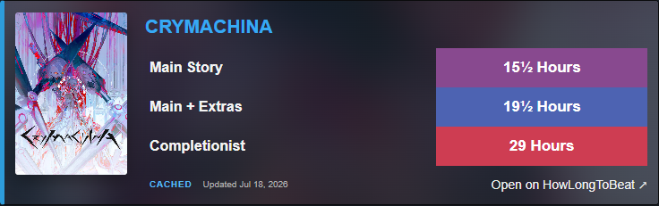

# HLTB for Steam — Unofficial

An independent, privacy-friendly Chrome and Firefox extension that adds HowLongToBeat completion times to Steam game pages, including Steam's embedded browser.



## Features

- Main Story, Main + Extras, and Completionist estimates.
- Compact horizontal card using the Steam page artwork, colored time bars, and a blurred backdrop.
- An autonomous local snapshot for Steam's embedded browser, where HLTB rejects extension requests.
- Strict title matching: uncertain results are never shown as facts.
- Seven-day local cache with a saved-result fallback during temporary outages.
- English and Russian interface selected from the browser language.
- Configurable categories, time format, cache duration, and cache clearing.
- Manifest V3, no analytics, ads, remote code, or developer backend.

## Install

Download the Chrome ZIP from the latest [GitHub Release](../../releases/latest), extract it, open `chrome://extensions`, enable **Developer mode**, choose **Load unpacked**, and select the extracted folder.

Firefox releases also include an unsigned `.xpi` development build. Load it temporarily from `about:debugging#/runtime/this-firefox` using **Load Temporary Add-on**. Permanent installation in regular Firefox requires Mozilla AMO signing; the package already contains its stable Gecko ID and current data-transmission declaration.

For development:

```sh
npm ci
npm run dev
```

Production checks and packaging:

```sh
npm run check
npx playwright install chromium
npm run test:browser
npm run test:live -- 2258500 CRYMACHINA
npm run build:firefox
npm run verify:firefox
npm run zip:all
```

The unpacked extension is written to `.output/chrome-mv3`; the release ZIP is written to `.output/`.
The opt-in live smoke test loads the built extension in an isolated Chromium profile, opens the real Steam page, and saves its widget screenshot under `live-smoke/`.

## Architecture

The Steam content script extracts the App ID, visible title, and existing Steam artwork, then renders an isolated Shadow DOM card. A short-lived Manifest V3 service worker owns the HLTB adapter, strict matcher, request concurrency, versioned `chrome.storage.local` cache, and local snapshot lookup.

Steam's embedded Chromium uses a compact local snapshot because HLTB rejects its network fingerprint. Chrome and Firefox continue to prefer current HLTB responses and use the snapshot only when the service is unavailable. The snapshot contains no images, uses exact normalized matches only, and identifies its data date in the widget. Its 52,000+ records are split into 64 buckets so each lookup reads only a small portion.

Snapshot updates are manual and reviewable. `npm run snapshot:import -- path/to/fallback-data.json` regenerates the compact files; `npm run verify:snapshot` verifies coverage, size, rows, and checksums. CI validates the committed snapshot and never scrapes HLTB.

## Privacy and independence

Chrome and Firefox send the Steam game title to HowLongToBeat when current data is requested. Steam's embedded browser resolves titles locally and sends nothing to HLTB. The extension has no telemetry or user accounts. See [PRIVACY.md](PRIVACY.md) for details.

This project is not affiliated with, endorsed by, or sponsored by Valve Corporation, Steam, or HowLongToBeat. Product names and trademarks belong to their respective owners.

Inspired by the original [k4sr4/hltbsteam](https://github.com/k4sr4/hltbsteam) project and rebuilt from a clean codebase for current Manifest V3 browsers.

## Русский

Расширение добавляет на страницы игр Steam время прохождения HowLongToBeat. В браузерах используются свежие сетевые данные, а внутри клиента Steam — компактный автономный снимок без обложек. Совпадения строго точные: при сомнении расширение не показывает чужое время.

## License

[MIT](LICENSE)
